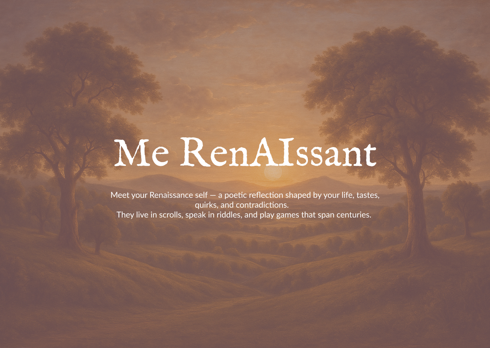

# Me RenAIssant 🎭✨



> *"Meet your Renaissance self — a poetic reflection shaped by your life, tastes, quirks, and contradictions. They live in scrolls, speak in riddles, and play games that span centuries."*

## 🌟 What is Me RenAIssant?

Me RenAIssant is an enchanting web application that creates your very own Renaissance-era doppelganger — a mirror soul from the past who shares your essence but speaks in the eloquent tongue of centuries gone by. Through an immersive onboarding journey, the application crafts a unique persona that reflects your modern life through the lens of Renaissance culture, art, and philosophy.

## ✨ Features

### 🎨 **Personalized Renaissance Mirror Creation**
- **Deep Personality Mapping**: Answer thoughtful questions about your role, hobbies, preferences, and dreams
- **AI-Powered Persona Generation**: Advanced algorithms create a unique Renaissance character based on your responses
- **Rich Character Development**: Each doppelganger comes with a detailed backstory, occupation, and personality traits
- **Authentic Renaissance Names**: Historically-inspired names and titles that match your character's essence

### 💬 **Intelligent Conversational AI**
- **Renaissance-Era Dialogue**: Your doppelganger speaks in authentic period language with "thee," "thou," and poetic expressions
- **Contextual Conversations**: Powered by advanced AI that maintains character consistency and historical accuracy
- **Multiple Chat Sessions**: Create and manage different conversation threads with your Renaissance self
- **Persistent Memory**: Conversations are saved and can be resumed across sessions

### 🏰 **Joust Centre - Renaissance Gaming**
Experience the entertainment of the Renaissance era through three captivating games:

#### ♟️ **Chess of Time**
- **Multiple Difficulty Levels**: Easy (with move hints), Medium (balanced challenge), and Hard (expert level)
- **Flexible Time Controls**: Choose from quick 2-minute games to casual untimed matches
- **AI Commentary**: Your Renaissance doppelganger provides witty commentary throughout the game
- **Game Analysis**: Detailed post-game analysis and move evaluation
- **Session Persistence**: Long games are automatically saved and can be resumed later

#### 🎯 **Tic-Tac-Toe**
- Classic strategy game with Renaissance flair
- Play against your AI doppelganger
- Beautiful period-themed interface

#### 🔮 **House of Glyphs**
- Memory-based matching game featuring mystical Renaissance symbols
- Test your recall with ancient glyphs and forgotten symbols
- Progressive difficulty as you advance

### 🎭 **Immersive User Experience**
- **Responsive Design**: Seamlessly adapts to desktop, tablet, and mobile devices
- **Renaissance Aesthetics**: Rich color palette inspired by medieval manuscripts and Renaissance art
- **Smooth Animations**: Fluid transitions and micro-interactions powered by Framer Motion
- **Intuitive Navigation**: Clean, organized interface that guides users through their journey

### 💾 **Data Management**
- **Supabase Integration**: Secure cloud storage for profiles, conversations, and game data
- **Real-time Sync**: Conversations and game states sync across devices
- **Privacy-Focused**: Session-based data storage with user control
- **Export Capabilities**: Download your conversation history

## 🛠️ Technology Stack

### Frontend
- **React 19** - Latest React with modern hooks and features
- **TypeScript** - Type-safe development
- **Tailwind CSS 4** - Utility-first styling with custom Renaissance theme
- **Framer Motion** - Smooth animations and transitions
- **React Router 7** - Client-side routing
- **Zustand** - Lightweight state management

### Backend & Services
- **Supabase** - Database, authentication, and real-time features
- **Groq AI** - Advanced language model for doppelganger conversations
- **Chess.js** - Chess game logic and validation
- **React Chessboard** - Interactive chess interface

### Development Tools
- **Vite** - Fast build tool and development server
- **ESLint** - Code linting and quality
- **TypeScript ESLint** - TypeScript-specific linting rules

## 🚀 Getting Started

### Prerequisites
- Node.js 18+ 
- npm or yarn package manager

### Installation

1. **Clone the repository**
   ```bash
   git clone https://github.com/yourusername/me-renaissant.git
   cd me-renaissant
   ```

2. **Install dependencies**
   ```bash
   npm install
   ```

3. **Set up environment variables**
   Create a `.env` file in the root directory:
   ```env
   VITE_SUPABASE_URL=your_supabase_url
   VITE_SUPABASE_ANON_KEY=your_supabase_anon_key
   VITE_GROQ_API_KEY=your_groq_api_key
   ```

4. **Start the development server**
   ```bash
   npm run dev
   ```

5. **Open your browser**
   Navigate to `http://localhost:5173` to begin your Renaissance journey!

## 🎯 Usage

### Creating Your Renaissance Self
1. **Begin the Journey**: Start with the onboarding process
2. **Answer Thoughtfully**: Provide details about your life, interests, and dreams
3. **Meet Your Doppelganger**: Discover your unique Renaissance persona
4. **Start Conversing**: Engage in meaningful dialogue with your mirror self

### Playing Games
1. **Visit the Joust Centre**: Access games from the sidebar
2. **Choose Your Challenge**: Select from Chess, Tic-Tac-Toe, or House of Glyphs
3. **Customize Settings**: Adjust difficulty and time controls for chess
4. **Enjoy Commentary**: Experience your doppelganger's witty observations

### Managing Conversations
- **Create New Chats**: Start fresh conversations on different topics
- **Export History**: Download your conversation transcripts
- **Delete Conversations**: Remove chats you no longer need (except the main conversation)

## 🎨 Design Philosophy

Me RenAIssant embraces the aesthetic principles of the Renaissance era while maintaining modern usability:

- **Rich Color Palette**: Warm browns, golds, and mints inspired by illuminated manuscripts
- **Typography**: Custom Renaissance-inspired fonts (IM Fell English) paired with modern Lato
- **Smooth Interactions**: Every click, hover, and transition is carefully crafted
- **Responsive Layout**: Beautiful on every device, from phone to desktop
- **Accessibility**: Designed with inclusive principles in mind

## 🤝 Contributing

We welcome contributions to Me RenAIssant! Whether you're fixing bugs, adding features, or improving documentation, your help is appreciated.

### Development Guidelines
- Follow the existing code style and TypeScript patterns
- Write meaningful commit messages
- Test your changes thoroughly
- Update documentation as needed

## 📜 License

This project is licensed under the MIT License - see the [LICENSE](LICENSE) file for details.

## 🙏 Acknowledgments

- **Renaissance Artists**: For inspiring the visual design and cultural elements
- **Chess Masters**: For the timeless game that bridges centuries
- **Open Source Community**: For the amazing tools and libraries that make this possible
- **AI Researchers**: For advancing the technology that brings our doppelgangers to life

---

*"In the dance of memory and meaning, truth reveals itself to those who seek..."*

**Start your Renaissance journey today!** 🎭✨